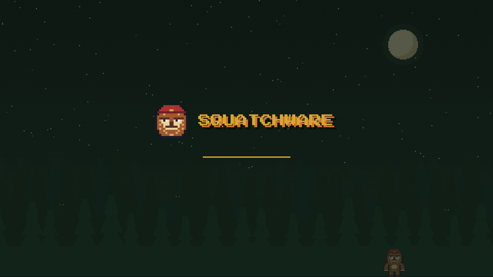

# Squatchware for Omarchy

A pixel-art Omarchy theme from [Squatchware](https://squatchware.dev): night forest, parchment
text and campfire gold. The squatch comes along to the lock screen, the boot screens and the
screensaver. The daylight version is
[Squatchware Light](https://github.com/squatchware/omarchy-squatchware-light-theme).

| | Squatchware | Squatchware Light |
|---|---|---|
| Desktop |  |  |
| Lock / boot |  |  |

## Install

```sh
omarchy theme install https://github.com/squatchware/omarchy-squatchware-theme
omarchy theme install https://github.com/squatchware/omarchy-squatchware-light-theme   # optional
```

Then the extras, which work for both variants:

```sh
~/.config/omarchy/themes/squatchware/extras/install-extras.sh          # screensaver hook
~/.config/omarchy/themes/squatchware/extras/install-extras.sh --boot   # + boot splash and boot menu (sudo)
```

## What's in it

- **Colours** for everything Omarchy themes (terminals, Hyprland, the shell, btop, editors…),
  generated by Omarchy from `colors.toml`. Every text colour clears 4.5:1 on its background.
- **Wallpapers:** pixel-art scenes drawn at 480×300 and scaled ×8 with no smoothing. `01-sighting`
  has the squatch at the edge of the trees; `02-treeline` looks empty (it isn't: watch for eyes).
- **Lock screen:** squatch head and SQUATCHWARE wordmark (`unlock.png`).
- **Boot splash (Plymouth):** the same logo on the theme's colours, including the disk-unlock prompt.
- **Boot menu (Limine):** SQUATCHWARE branding, the palette, and the night forest as the wallpaper.
- **Screensaver:** the squatch head and wordmark in block characters, animated by Omarchy's `ttfx`.
  The hook swaps it in whenever a Squatchware theme is set and puts your previous art back when you
  switch to anything else.

Plymouth only follows the theme when you run `omarchy plymouth set by theme squatchware` (or
`squatchware-light`), so re-run it after switching between dark and light. The Limine menu is
always the night version. `omarchy refresh limine` resets `/boot/limine.conf`, so run
`extras/install-bootloader.sh` again after one; `extras/install-bootloader.sh --restore` undoes it.

## Building

Both repos are generated by `python3 src/build.py`: palettes live in `src/palettes.py` and scenes
in `src/scene.py`. It writes the dark theme into this repo's root and the light theme into a
sibling checkout of `omarchy-squatchware-light-theme`. The squatch sprites and pixel font come from
the Squatchware brand kit, which isn't public (point `SQUATCHWARE_BRAND` at a copy). Everything is
built and committed, so installing needs none of this. `python3 src/build.py --check` runs the
contrast check on its own.

Press Start 2P is by CodeMan38, SIL Open Font License.
