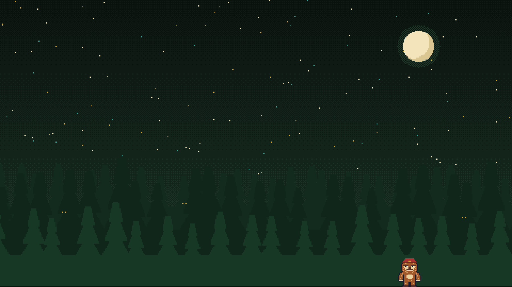
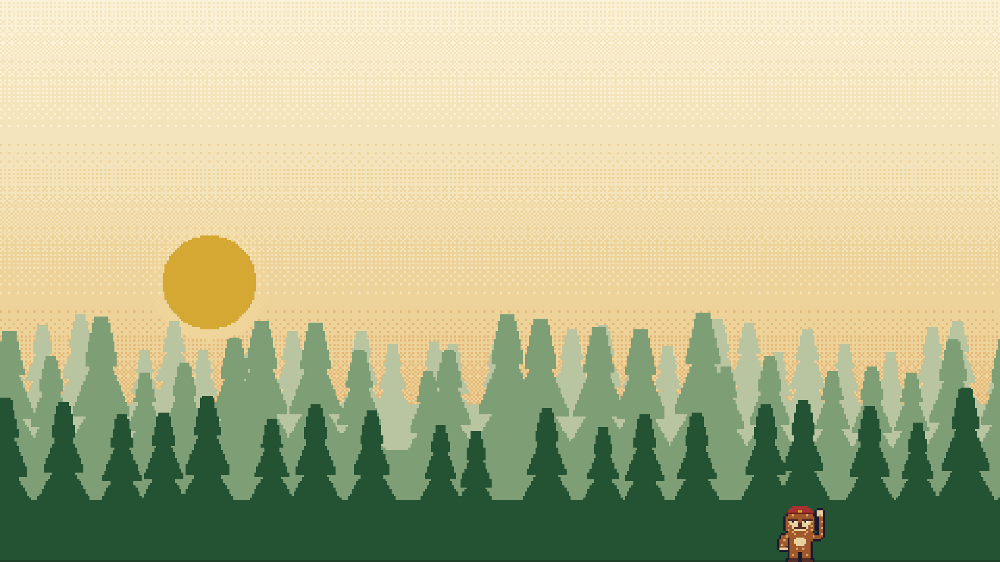
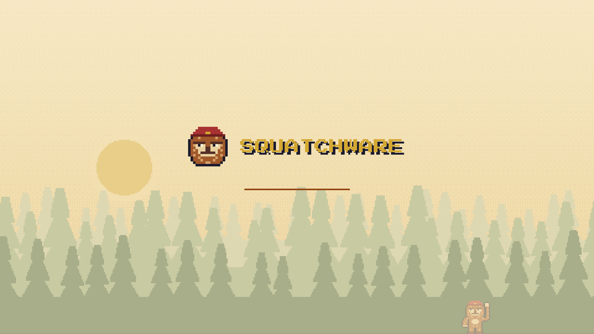

# Squatchware for Omarchy

A pixel-art Omarchy theme in dark and light, from [Squatchware](https://squatchware.dev):
night forest, parchment text and campfire gold. The squatch comes along to the lock screen, the
boot screens and the screensaver.

| | Squatchware | Squatchware Light |
|---|---|---|
| Desktop |  |  |
| Lock / boot |  |  |

## What's in it

- **Colours** for everything Omarchy themes (terminals, Hyprland, the shell, btop, editors…),
  generated by Omarchy from `colors.toml`. Every text colour clears 4.5:1 on its background.
- **Wallpapers:** pixel-art scenes drawn at 480×300 and scaled ×8 with no smoothing. `01-sighting`
  has the squatch at the edge of the trees; `02-treeline` looks empty (it isn't: watch for eyes).
- **Lock screen:** squatch head and SQUATCHWARE wordmark (`unlock.png`).
- **Boot splash (Plymouth):** the same logo on the theme's colours, including the disk-unlock prompt.
- **Boot menu (Limine):** SQUATCHWARE branding, the palette, and the night forest as the wallpaper.
- **Screensaver:** the squatch head and wordmark in block characters, animated by Omarchy's `ttfx`.

## Install

```sh
./install.sh                                  # both themes + the screensaver hook
omarchy theme set squatchware                 # or squatchware-light
```

Boot screens need sudo, so run these in a terminal:

```sh
omarchy plymouth set by theme squatchware     # boot splash + disk unlock (match your theme)
./install-bootloader.sh                       # Limine boot menu; --restore undoes it
```

Plymouth only follows the theme when you run that command, so re-run it after switching between
dark and light. The Limine menu is always the night version. `omarchy refresh limine` resets
`/boot/limine.conf`, so run `./install-bootloader.sh` again after one.

The screensaver art is swapped in by `hooks/squatchware-screensaver` whenever a Squatchware theme
is set, and your previous art is put back when you switch to anything else.

## Building

`python3 build.py` regenerates `themes/` and `bootloader/`. Palettes live in `palettes.py`,
scenes in `scene.py`; the squatch sprites and pixel font come from the Squatchware brand kit
(`../squatchware.dev/brand`, override with `SQUATCHWARE_BRAND`). `python3 build.py --check` runs
the contrast check on its own.

Press Start 2P is by CodeMan38, SIL Open Font License.
